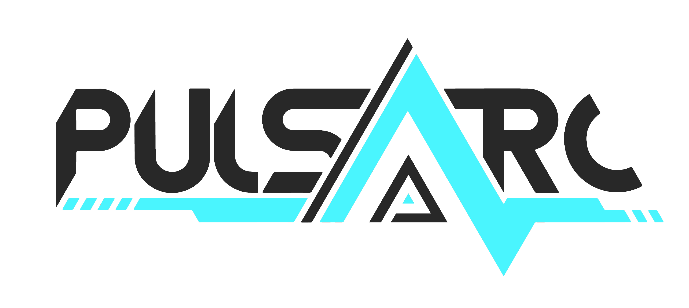

  

# Pulsarc

## About
Pulsarc is a community-focused and open-source omni-directional rhythm game. Notes (also called "arcs") fall from the edges of the screen towards a crosshair in the center of the screen. This crosshair is equivalent to a judgement line in other rhythm games. The gameplay is directly inspired by (Intralism)[https://store.steampowered.com/app/513510/Intralism/].

This layout allows for interesting gimmicks to be introduced to the gameplay. For example, manipulating the size of the crosshair during the middle of gameplay (also known "Zooms"). Currently only basic Intralism-based zooms are implemented, but as time goes one we would like to introduce more control over zooms, and other mechanics such as crosshair rotation and movement.

The goal with Pulsarc is to take the unique gameplay of Intralism and bring it to the next level. A better editor with more control over the gameplay of maps, better competitive features, and good developer-community relationships to foster further growth.

Pulsarc is currently in active development. Pulsarc is still a young project, and is in an early Alpha state. The core gameplay is here, but many features haven't been realized yet, and there are currently many bugs.

## How to Play
Head over to our [Releases Page](https://github.com/PulsarcGame/Pulsarc/releases) and download the most recent version. Find and launch Pulsarc.exe to get started. If you want to play the current development build, check out the [Contributing](README.md#contributing) section below.

Play Game launches the song select. Use the scroll wheel to move the song select up or down. Click on the map you want to start playing. Default binds for gameplay are D - Left, F - Up, J - Down, K - Right.

Settings will send you to the settings menu, where you change different options. Note: The settings menu is a little glitchy at the moment, and settings don't save past your current play session. For more consistency and permanence, go into the Pulsarc folder, and find "config.ini" Here you can see different options you can change. Comments have been included in the release version to help explain each option. You'll need to restart Pulsarc after saving any changes made in the config file.

Currently Multiplayer and Editor are disabled. As these are developed and added to the game they will be enabled.

And Quit shuts the game down.

## How to Add Maps
Right now releases comes with one map to play, but currently there's no editor or map-hosting service to get more. However, Pulsarc can convert osu!mania or Intralism maps into a pulsarc beatmap for you to play.
To convert a map, find and open ``config.ini`` in your text editor of choice. Put "Intralism" or "Mania" after ``Game = ``. Find the path to the __folder__ of the map you want to convert. Copy the path address and then paste it after ``Path = ``. If you're converting an Intralism map, and want to import a specific background image from teh map, copy and paste the image name in front of ``BGImage = `` Save config.ini. You do not need to restart Pulsarc if it's currently running. In the Pulsarc Song Select screen, press the convert button (Default is "C"). If you gave the correct path, the map data should be converted to a new beatmap folder in the /Songs folder, and the Song Select screen should update to include the new map.

## Build and Run
To build and run Pulsarc, follow these steps:
- Install the [.NET Core 2.2 SDK](https://dotnet.microsoft.com/download/dotnet-core/2.2)
- Clone the Pulsarc repository and its submodules `git clone --recurse-submodules https://github.com/PulsarcGame/Pulsarc.git`
- Build & Run Pulsarc with `dotnet run --project Pulsarc`

## Contributing
If you are interested in contributing, it is strongly recommended that you join us on our [Discord Server](https://discord.gg/SYfpvfJ). Here you can chat in real time with other contributors, testers, and other community members. 

It is also useful if you talk about a feature you want to develop on Discord or open a new issue before development starts. We will discuss whether it's something we want in Pulsarc.

You can make a contribution through a pull request. Don't make requests for the master branch, use the [develop branch](https://github.com/PulsarcGame/Pulsarc). Please have one branch/pull request per feature, and keep pull requests short and sweet. We will let you know if we want to discuss more, or you can bring up a discussion on the Discord server.

When contributing, please follow our (code style)[CODESTYLE.md]. If you have any issues with the code style feel free to discuss on the issues board or our Discord server.

## License
Pulsarc uses multiple submodules which are subject to their own individual licensing. Please see each submodule to view their license(s).

The code in this repository is released and licensed under the [Mozilla Public License 2.0](LICENSE). Please see the [LICENSE](LICENSE) file for more information. In short, if you are making any modifications to this software, you **must** disclose the source code of the modified version of the file(s), and include the original copyright notice.
